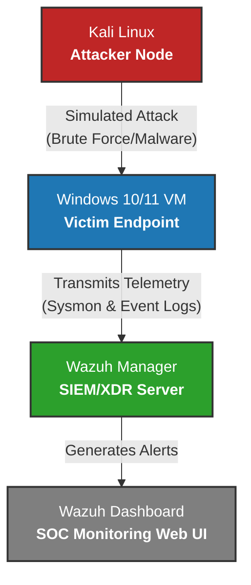

# SOC Automation & Threat Detection Lab (Wazuh SIEM)

## Project Overview
This project demonstrates the setup of an enterprise-grade open-source SIEM/XDR platform (Wazuh) to monitor network traffic, windows events, and detect security threats in real-time.

## Tools & Technologies Used
* **SIEM/XDR:** Wazuh (Manager & Dashboard)
* **Hypervisor:** VirtualBox / VMware
* **Telemetry:** Windows Event Logs, Sysmon, Linux Syslog
* **Attack Platform:** Kali Linux

## Lab Architecture

## Step-by-Step Implementation
1. Installed Wazuh Manager on a Linux environment.
2. Configured Wazuh Agents on Windows and Linux endpoints.
3. Enabled Sysmon on the Windows machine for advanced process auditing.
4. Simulated real-world attacks (like Brute Force and Malicious Execution).
5. Analyzed alerts on the Wazuh Security Dashboard.

## Key Findings & Alert Analysis

